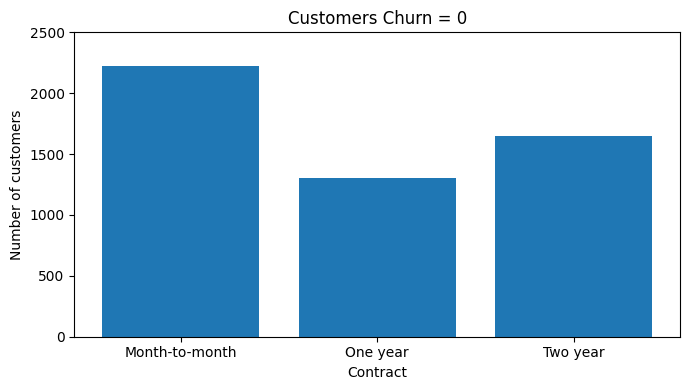
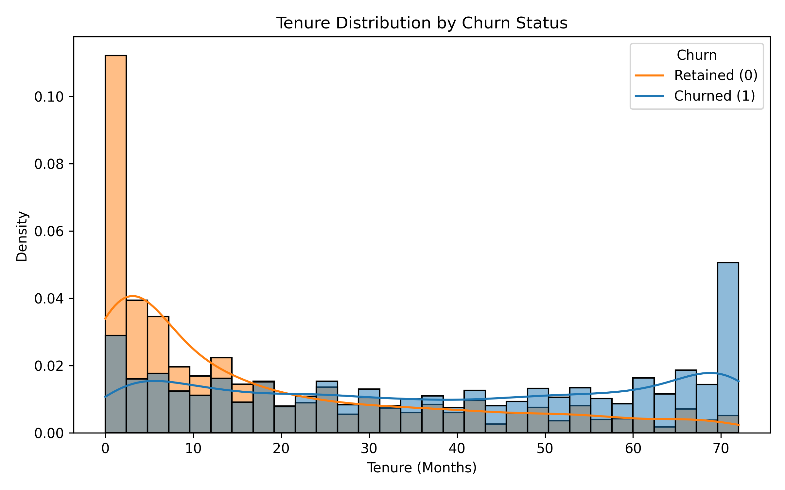
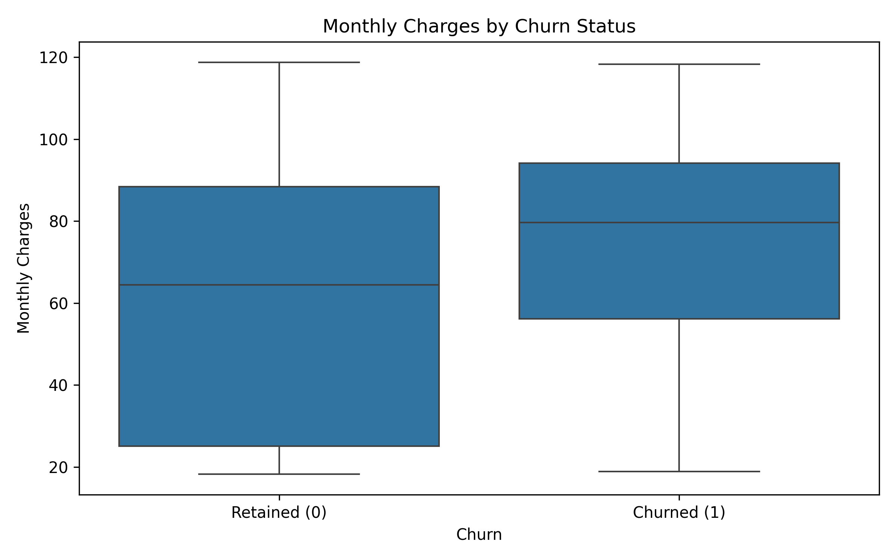
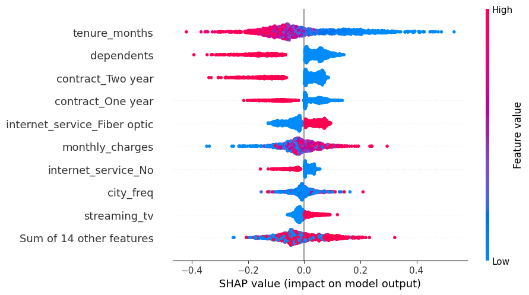
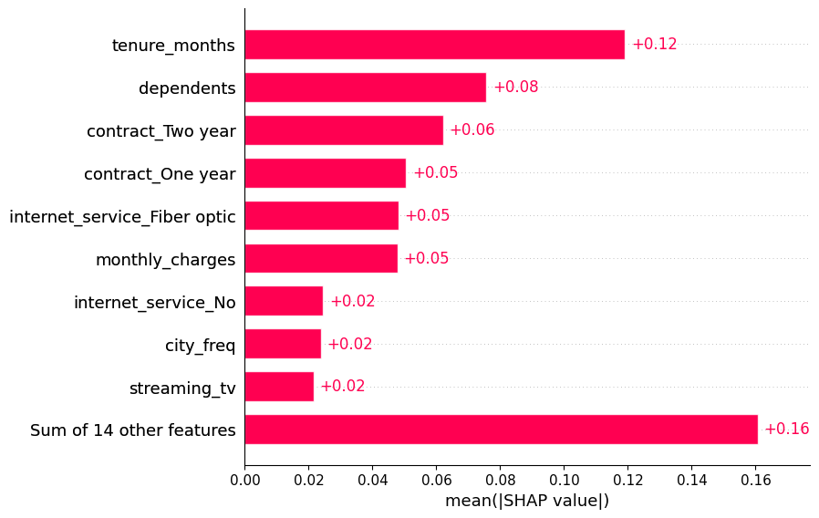
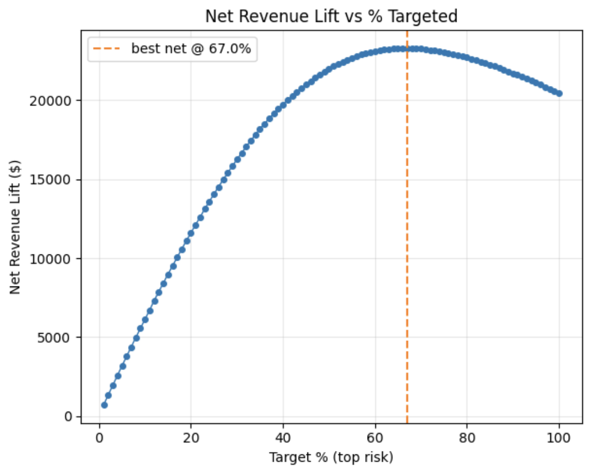
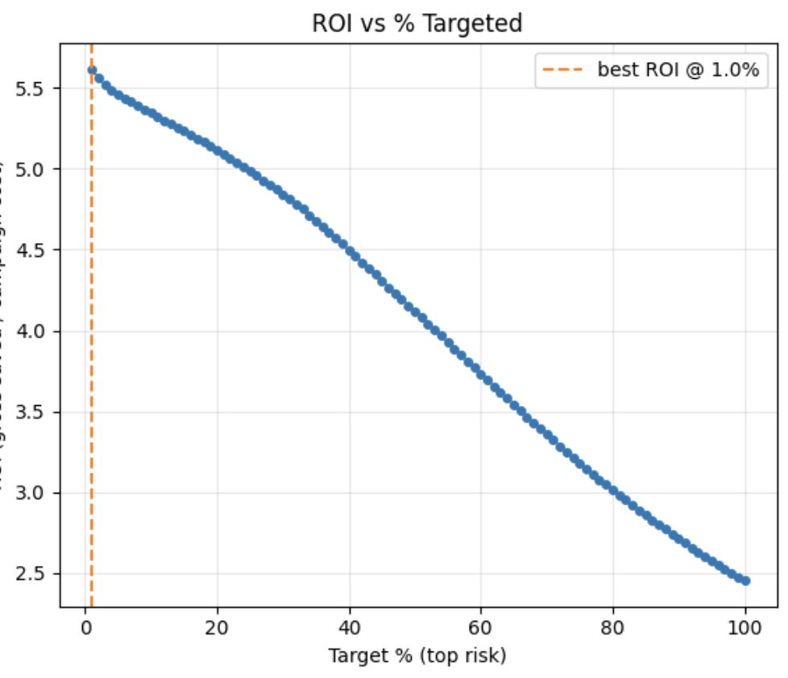
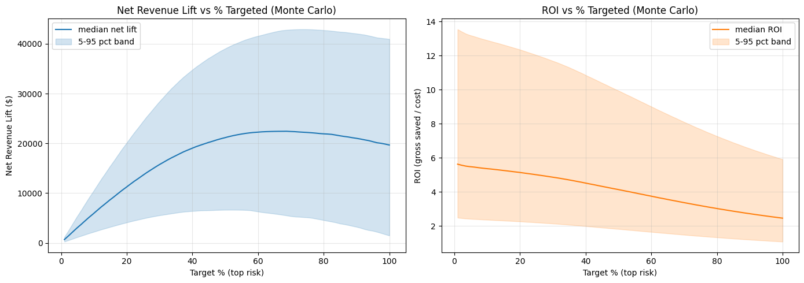

# 📊 Telecom Customer Churn Prediction & Revenue Optimization

---

## 🚀 Executive Summary

Customer churn directly erodes recurring revenue in subscription-based businesses.

This project builds a production-ready churn prediction and retention optimization system that:

- Predicts churn with strong performance (ROC-AUC = 0.846)
- Identifies key churn drivers using SHAP explainability
- Optimizes decision thresholds based on business priorities
- Quantifies financial impact through retention simulation
- Evaluates robustness using Monte Carlo uncertainty modeling

This project bridges machine learning and business decision science.

---

## 🔎 Problem Statement

Telecom providers face significant revenue loss due to customer churn.

Key questions:

1. Which customers are most likely to churn?
2. Why are they churning?
3. How should we intervene?
4. What is the expected financial return?
5. How robust is the strategy under uncertainty?

---

## 📦 Dataset Overview

- ~7,000 telecom customers
- Target variable: `churn_value`
- Features include:
  - Tenure
  - Contract type
  - Internet service
  - Billing & payment details
  - Demographics
  - Location

---

# 📊 Initial Exploratory Data Analysis (EDA)

## 📈 Churn by Contract Type

**Insight:**  
Month-to-month customers churn significantly more than long-term contract customers.

---

## 📈 Churn vs Tenure

**Insight:**  
Short-tenure customers represent the highest churn-risk group.

---

## 📈 Monthly Charges vs Churn

**Insight:**  
Higher monthly charges correlate with increased churn probability.

These early signals guided feature engineering and modeling decisions.

---

# 🧹 Data Cleaning & Preparation

- Removed identifier columns
- Dropped leakage variables
- Handled missing values
- Encoded categorical variables
- Frequency encoded location (`city`)
- Standardized numerical features

Train/Test Split: 80/20 (Stratified)

---

# ⚙️ Feature Engineering

- Binary encoding for Yes/No variables
- One-hot encoding:
  - Contract type
  - Internet service
  - Payment method
- Frequency encoding for city
- StandardScaler applied to tenure & monthly charges

---

# 🤖 Modeling

Models evaluated:

- Logistic Regression (class-weighted)
- Random Forest
- HistGradientBoostingClassifier

Imbalance handled via class weighting and threshold tuning.

---

# 📈 Model Performance

| Metric | Score |
|--------|--------|
| ROC-AUC | **0.846** |
| Precision | 0.78 |
| Recall | 0.81 |
| F1 Score | 0.79 |

The model effectively ranks high-risk customers for targeted retention.

---

# 🎯 Threshold Optimization

Instead of default probability threshold (0.5):

- Optimized for recall (business priority: capture churners)
- Evaluated precision-recall trade-offs
- Selected threshold aligned with retention objectives

---

# 🔍 Explainability (SHAP Analysis)

## 🌍 Global Impact Summary

## 🏆 Feature Importance Ranking

### Key Drivers

- Short tenure strongly increases churn risk
- Month-to-month contracts significantly increase churn
- High monthly charges increase churn probability
- Long-term contracts reduce churn risk
- Fiber optic customers show elevated churn tendency

---

# 💰 Retention Strategy Simulation

Assumptions:

- Avg revenue per customer = $200
- Campaign cost per customer = $10
- Retention effectiveness = 30%

---

## 📊 Net Revenue Lift vs % Targeted

- Maximum net lift achieved at ~67% targeting
- Strategy remains profitable across wide targeting range

---

## 📊 ROI vs % Targeted

- Highest ROI achieved at small targeting (~1%)
- Tradeoff between efficiency and total profit

---

## 📊 Monte Carlo Uncertainty Simulation

- Median net lift remains strongly positive
- 5th percentile scenario remains profitable
- Strategy robust under uncertainty

---

# 📊 Financial Summary

| Metric | Value |
|--------|--------|
| Optimal Profit Targeting | ~67% |
| Highest ROI Targeting | ~1% |
| Median Net Lift | ~$22K |
| Worst-Case Net Lift (5%) | ~$6K |
| ROI Range | 2.4x – 5.6x |

---

# 📌 Key Business Takeaways

1. Short-tenure customers are the highest churn-risk segment.
2. Contract structure is the strongest retention lever.
3. Targeting top 20–70% highest-risk customers yields strong revenue lift.
4. Strategy remains profitable under conservative assumptions.
5. Model-driven targeting enables optimized retention budgeting.

---

# 🎯 Final Recommendation

Customers on month-to-month contracts with high monthly charges and low tenure are significantly more likely to churn.

Targeting the top 20% highest-risk customers could potentially reduce churn by ~8%, improving projected revenue retention.

Scaling up to ~67% maximizes total profit while maintaining strong ROI.

This framework translates predictive modeling into measurable business impact.

---

# 🏁 Conclusion

This project demonstrates a complete ML-to-business lifecycle:

- Predictive modeling
- Explainability
- Threshold optimization
- Revenue simulation
- Risk quantification

Transforming churn prediction into strategic revenue protection.
